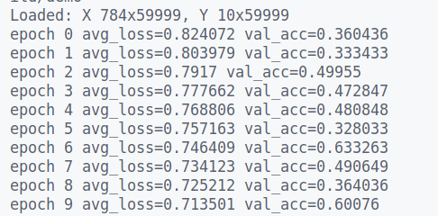

Сразу сори за то что так фигово запускать, я настрою чтобы было легче

1. Чтобы запустить надо добавить в data/mnist датасеты отсюда https://github.com/phoebetronic/mnist/tree/main

2. склонировать csv-parser git clone https://github.com/vincentlaucsb/csv-parser.git

3. склонировать и сбилдить folly

git clone https://github.com/facebook/folly
cd folly
sudo ./build/fbcode_builder/getdeps.py install-system-deps --recursive

4. скачать Eigen3::Eigen

5. Обучение происходит в файле examples/demo.cpp

